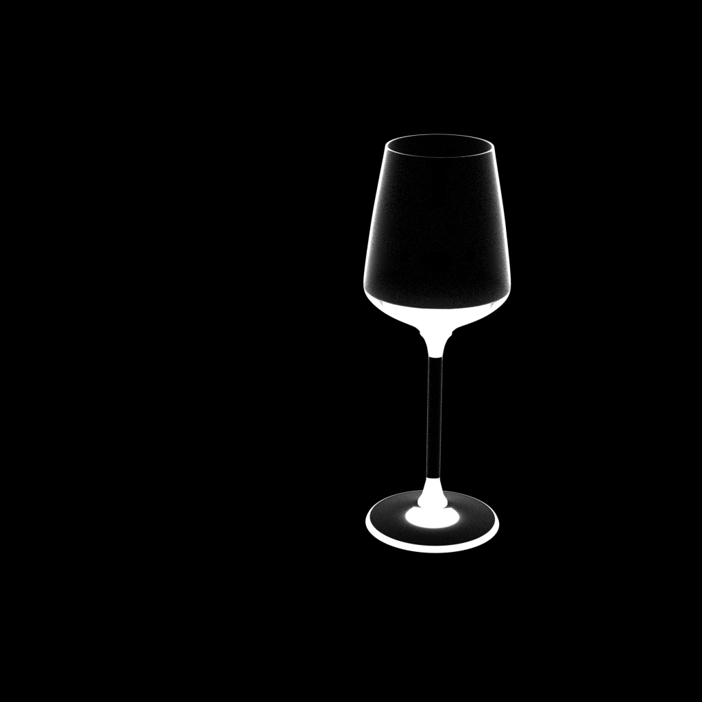
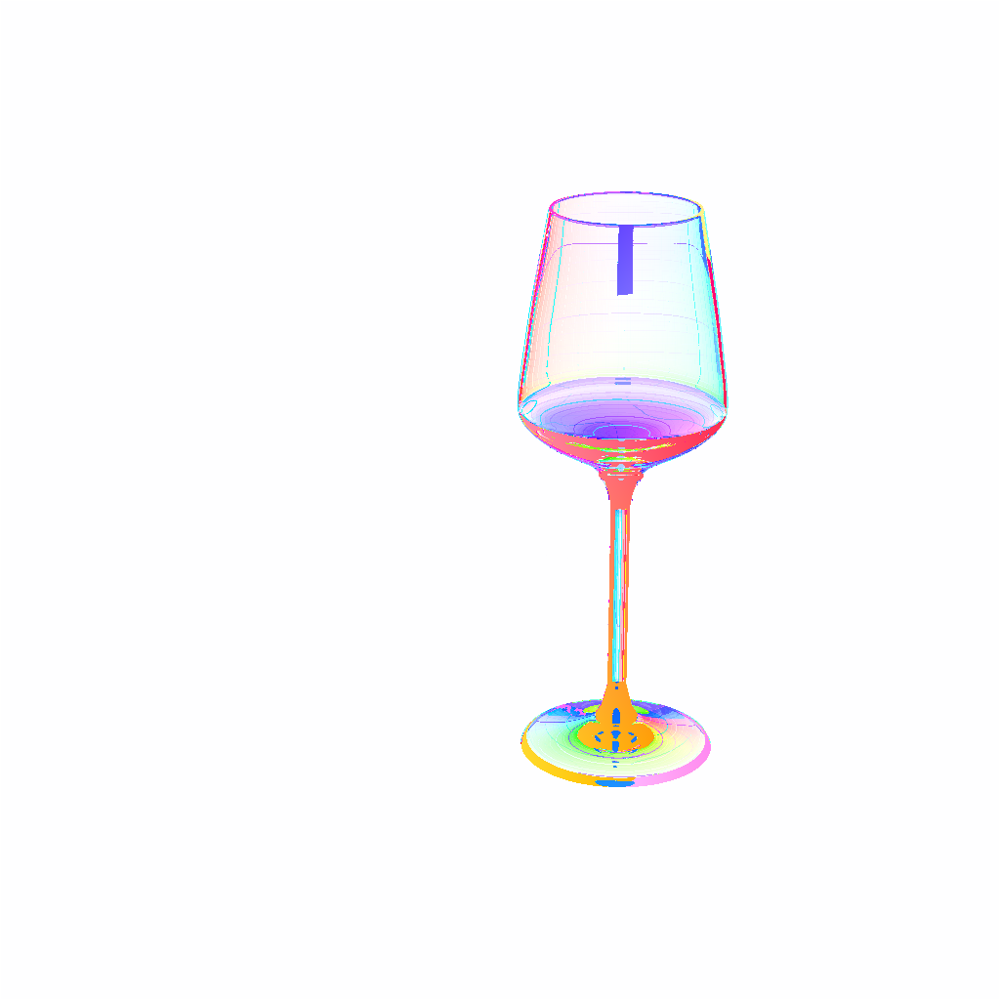

# Transparent_Blender
In this repository, use blender python API. &rarr; <a href="https://docs.blender.org/api/current/index.html" target="_blank">bpy</a>

Download free hdri if you want.
Download free transparent object models, and use it.

I collected the hdri and objects from free license website like <a href="https://polyhaven.com/license" target="_blank">Polyheaven</a>.


# Result
1. To run the blender-python code, there are two ways: just execute the python file in the terminal or run the python code in the blender program.
If you want to do it in the terminal, run ```blender --python /home/me/my_script.py```


* background

 

* object with background

 

2. To get the alpha matte or attenuation map from blender outputs, run ```./render_flow.sh```. Don't forget to modified the root path.

* alpha matte / attenuation map

 

* calculated flow

 


# Additional explaination
```checkerboard.py``` can make checkerboard images.
```graycode.py``` can make graycode images.

# Reference
I appreciate for the code <a href="https://github.com/guanyingc/TOM-Net_Rendering" target="_blank">TOM-Net</a> !
